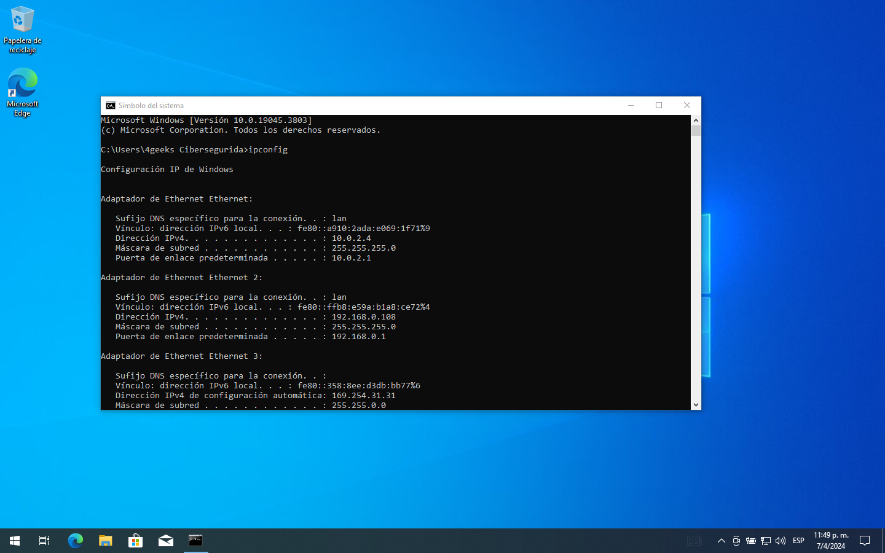

# `04` Testing the connection

Once inside each virtual machine, we can see that the interfaces are shown as normal computer connections.

If you check the IP addresses of each one, you can see that they are in the same IP range. For them run the following commands in the terminals of each system.

> **On Windows**: `ipconfig`

> **On Debian**: `ip addr`

Once the addresses are verified you can perform a `ping` test to verify connectivity between the two machines. The command is identical on Windows and Debian, just follow it with the IP address of the machine you want to test connection with. 

For example, below you can see how 2 virtual machines can `ping` each other.

> `ping 10.0.2.4`

> `ping 10.0.2.15`

> By default, there is something in Windows that does not allow it to respond to the ping request received by the machine. Find out what it is and disable it to be able to test.
