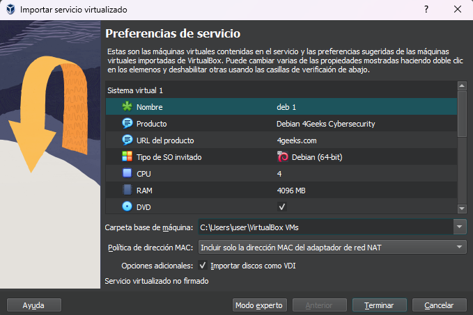

# `001` Importando una maquina virtual

## 001 Descarga el archivo ISO para windows

 > [Descarga aquí](https://storage.googleapis.com/breathecode/virtualbox/deb.ova).

## 02 Instala la maquina virtual windows con el archivo ISO

Iniciar el Asistente de Nueva Máquina:

Haz clic en el botón Nueva en la barra de herramientas.
Configuración Inicial:

Nombre: Introduce un nombre para tu máquina virtual (por ejemplo, "Windows10").
Tipo: Selecciona Microsoft Windows.
Versión: Selecciona Windows 10 (64-bit) o la versión correspondiente de Windows que estás instalando.
Asignar Memoria:

Asigna la cantidad de memoria RAM que deseas asignar a la máquina virtual. Se recomienda al menos 2 GB (2048 MB), pero 4 GB (4096 MB) o más es ideal para un rendimiento óptimo.
Crear un Disco Duro Virtual:

Selecciona Crear un disco duro virtual ahora y haz clic en Crear.
Tipo de Archivo de Disco Duro:

Selecciona VDI (VirtualBox Disk Image) y haz clic en Siguiente.
Almacenamiento en Disco Duro Físico:

Selecciona Reservado dinámicamente y haz clic en Siguiente.
Tamaño y Ubicación del Archivo:

Asigna un tamaño adecuado para el disco duro virtual. Se recomienda al menos 40 GB.
Elige la ubicación donde deseas guardar el archivo del disco duro virtual y haz clic en Crear.
3. Configurar la Máquina Virtual
Seleccionar la Máquina Virtual:

Selecciona la máquina virtual recién creada en la lista y haz clic en Configuración.
Configurar Almacenamiento:

En la sección Almacenamiento, selecciona Controlador: IDE.
Haz clic en el ícono del disco con un signo + y selecciona Elegir disco.
Navega hasta el archivo ISO de Windows que has descargado y selecciónalo.
Configurar Red:

En la sección Red, asegúrate de que el Adaptador 1 esté habilitado y configurado como NAT para acceso básico a internet.
4. Iniciar la Máquina Virtual y Proceder con la Instalación de Windows
Iniciar la Máquina Virtual:

Selecciona la máquina virtual en la lista y haz clic en Iniciar.
Iniciar Instalación de Windows:

La máquina virtual debería arrancar desde el archivo ISO y mostrar el instalador de Windows.
Sigue las instrucciones en pantalla para instalar Windows en la máquina virtual.
Completar la Instalación:

Configura las opciones de idioma, hora y teclado.
Introduce la clave de producto de Windows si se te solicita.
Elige Instalación personalizada y selecciona el disco virtual creado anteriormente para instalar Windows.
Sigue las instrucciones para completar la instalación.
### Importar archivo OVA

### Confirmación de la configuración

## 03 Ejecuta tu nueva máquina virtual

Una vez termine el proceso de importación, estas listo para arrancar tu nueva máquina Debian. La máquina ya viene configurada con claves de acceso, pero como buen estudiante de ciberseguridad, sabes que deberías cambiarlas por alguna más segura.

> **Información de acceso** 
**Usuario**: deb 
**Clave**: 123456 
**ClaveRoot**: 123456
